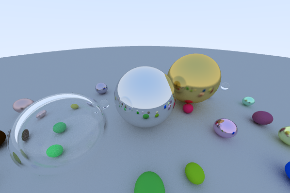

# Simple Raytracing

This is a simple CPU ray tracer (more precisely, path tracer) which is based on ["Ray Tracing in One Weekend" by Peter Shirley](http://www.realtimerendering.com/raytracing/Ray%20Tracing%20in%20a%20Weekend.pdf). The implementation largely follows his tutorial, but instead of writing out the result to an image file, it is rendered to a window on screen. I also added multi-threaded rendering by implementing a simple task pool using C++ 11 threads and an interative refinement of the rendered image to reduce noise over time. 

The camera is controlled by a simple implementation of the trackball metaphor. It can be rotated around the center of the scene using the arrow keys. Using the Left Shift modifier in combination with the up or down arrow keys will increase or decrease the radius of the trackball. Note that there are no collision checks with the scene geometry and having the camera inside of a sphere will not result in a correct rendering.

The implementation uses [GLM](https://glm.g-truc.net) and [SDL2](https://www.libsdl.org/index.php).

Use [CMake](https://cmake.org/) to generate your build files (e.g., Makefile on Unix or Visual Studio solution on Windows). For Linux, you will need to have SDL2 installed using your package manager (for Windows, it is included). GLM is directly included. Compiled and tested on Linux Mint 19 with GCC 7.4 and Windows 7 (64-bit) with Visual Studio 2017.

*Note*: the random number generation (`drand48()` on Linux and `rand()` on Windows) is not thread-safe and should ideally be replaced be a fast and reliable RNG per thread, but for this simple example I did not bother to do that.

